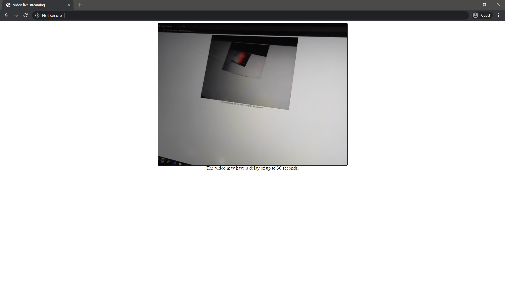

# Node / FFmpeg Webcam Streaming

- Streaming the webcam video to html with HLS(HTTP Live Streaming) format.
- It is Node.js wrapper of FFmpeg.
- It works on linux. (uses v4l2)

## How it works

- When the server starts, it execute FFmpeg.
- FFmpeg takes video from webcam and converts it to HLS format.
- The .m3u8 files and video segments are (statically) served by Node.js server.
- Now you can watch live video from HTTP page. The video will have up to 30 second delay.
- See [server](./index.js) and [html](./public/index.html) for better understand. It is very simple!

## How to run

1. It requires Node.js and FFmpeg. You can download FFmpeg [here](https://ffmpeg.org/download.html).
2. To initialize server, run `yarn install` or `npm install`
3. To start the server, run `node index.js`
4. Connect to localhost:3000 with a web browser.

## Screenshot

